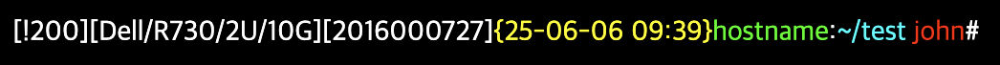

# ohmyzsh
ohmyzsh custom for KREONET

## Oh My Zsh

쉘 명령어 추천, 문법 강조 등을 위한 설정 모음입니다. 여러가지 테마와 플러그인을 제공합니다.

## 설치

루트 권한으로 다음을 실행합니다:

```sh
curl -s https://raw.githubusercontent.com/KREONET/ohmyzsh/refs/heads/main/install.sh | sh -s -
```

## 설명

[Oh My Zsh](https://github.com/ohmyzsh/ohmyzsh)는 기본으로 `$HOME/.oh-my-zsh`에 설치됩니다. 본 스크립트는 시스템 전역에서 사용되도록 `/oh-my-zsh`에 설치되도록 수정하였습니다.

[dallas theme을 수정](custom/themes/dallas.zsh-theme)하여 자산정보 확인을 위한 TAG 정보도 표시되도록 하였습니다.


* HNUM: History Number
    - 명령이 실행될 때마다 1씩 증가함
    - history 명령으로 지난 명령을 확인할 수 있으며, !100을 입력하면 100번째 입력했던 명령이 다시 입력됨
* TAG1, TAG2
    - /etc/tag1, /etc/tag2 의 내용
    - 실물 서버의 자산정보 입력 및 관리에 활용

## 설정 예제

```sh
echo Dell/R730/2U/10G > /etc/tag1 
echo 2016000727 > /etc/tag2
```

위와 같이 설정하면, 프롬프트가 다음과 같이 바뀝니다.


